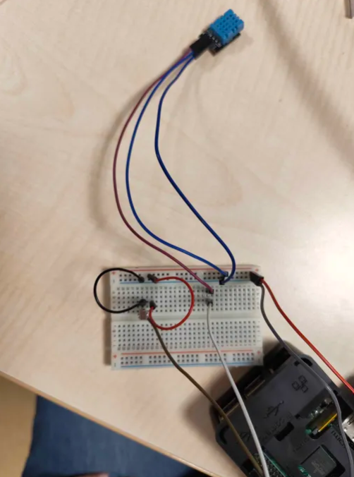
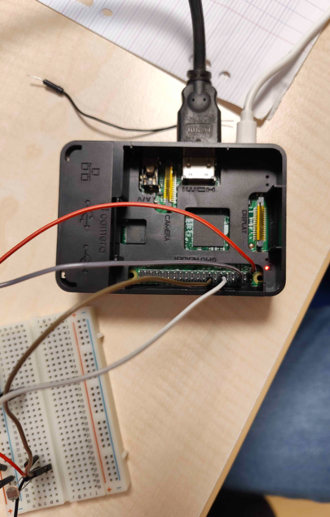
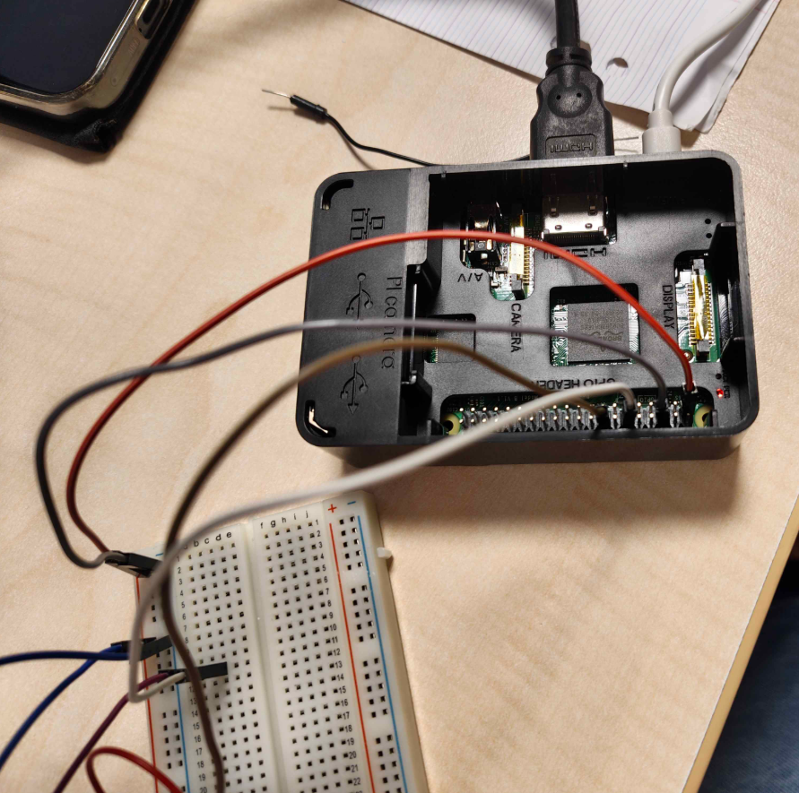
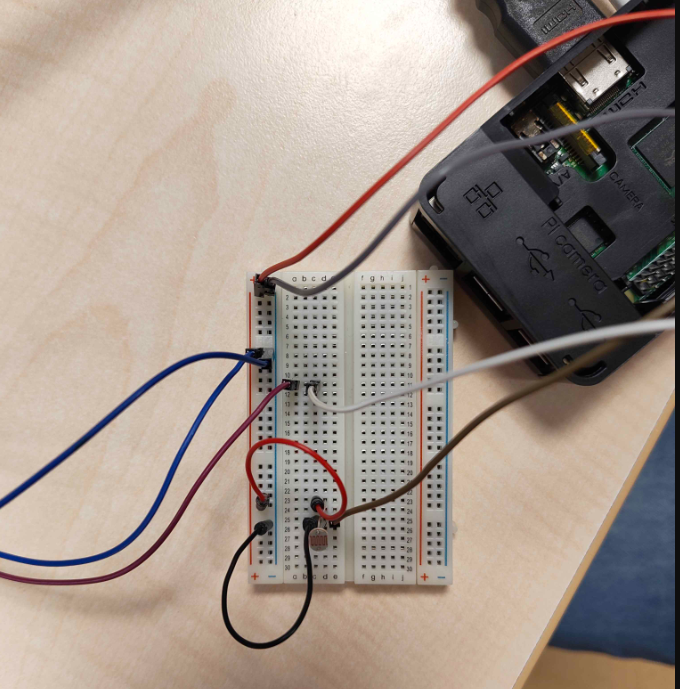

                                --- STATION MÉTÉO ---
                                    RASPBERRY PI 3b

                DOCUMENTATION :

        LIENS UTILES :

https://monraspberry.com/creer-une-station-meteo-avec-un-raspberry-pi/

https://www.tme.eu/fr/news/library-articles/page/68616/construisez-votre-propre-station-meteo-avec-raspberry-pi/

https://www.freva.com/fr/capteur-de-temperature-et-humidite-dht11-avec-raspberry-pi/?srsltid=AfmBOor4BssVaZOBlal3SJdbunC3OHLRWeMgrn0m8DLHxrks_n7Mke_k

https://www.google.com/search?sca_esv=ab7f61c36d6d1228&rlz=1C1FKPE_frFR1178FR1178&sxsrf=ANbL-n5BkCXxXBPYnkqn9-gQvZkL1SvDgg:1774605989266&udm=2&fbs=ADc_l-bpk8W4E-qsVlOvbGJcDwpnHC5OJXXTJvmMu2n9YYx-Gwv2pwuu9X9wxEE6tv5CJkS2Bo_lHakURSqrTqmbDSwWkFLRultp4pElwYAhEZlhvuA1ToU77R2uv7YCfCbmVjvTTx2r3kBGm2RgSgJ3zU8BgzwiNz6YROFeSmp4FxVxN4oLOOP_zXDP4z8YX1yBaqGrQFzSuXk2GFQKgO0YX4zOWaNuwg&q=raspberry+gpio&sa=X&ved=2ahUKEwiJ0ey86r-TAxVBRKQEHS4uGSMQtKgLegQIExAB&biw=1536&bih=730&dpr=1.25#sv=CAMSVhoyKhBlLUt6cEQzV0NoZ1BhSnNNMg5LenBEM1dDaGdQYUpzTToONUZvQkxvakJGaTU2bU0gBCocCgZtb3NhaWMSEGUtS3pwRDNXQ2hnUGFKc00YADABGAcgga-t9wVKCBABGAEgASgB

https://www.google.com/search?sca_esv=9c3417b67976150d&rlz=1C1FKPE_frFR1178FR1178&sxsrf=ANbL-n7V53BxmLB1GLarT7DPeFChsfUeeA:1773397951695&udm=2&fbs=ADc_l-bpk8W4E-qsVlOvbGJcDwpnHC5OJXXTJvmMu2n9YYx-G8xzgQk24aW1N_FyIND5zVCwECjrKJ3bGrzReCzh4k82c1-wGxqDH3N5n2ZRuzFemazZIf1v2x1gyO2sXtFBNX8Ds1lbSGP6_FJK3rZAWBYYKvRKKcpI3KCtijl41cDxiKft7gHQ-QJ2VUO0VEfZcSq6QuHVvx3yGBreX5LohmEwgzswWQ&q=raspberry+pi+pico+gpio&sa=X&ved=2ahUKEwj56tKX1pyTAxWMUaQEHbfgJwYQtKgLegQICxAB&biw=1536&bih=730&dpr=1.25

https://www.freva.com/fr/capteur-de-lumiere-photoresistance-avec-raspberry-pi/?srsltid=AfmBOorVhMh2W9sAdNgadc17ASVjsvqefkEDXDiv5Cx6d8nkOuU8oHTp

        CABLAGE :

        INSTRUCTIONS :

1. Télécharger et installer image ISO sur SD card -> RASPBIAN 
    -> suivre instructions et/ou se documenter sur procédure

2. Câbler raspberry -> vérifier le modèle et voir photos ci-dessus
    -> bien vérifier GPIO et PIN correspondants

3. Suivre la configuration dans le projet -> voir commandes + liens web ci-dessus
    -> configuration possible via SSH (à activer au moment de la configuration) ou avec un écran par câble (selon modèle rasberry)
    -> installation des différents packages sur le terminal linux (ATTENTION : bien vérifier composants à disposition pour éviter d'installer des packages inutilement)

4. Faire le script python pour les différentes fonctionnalités souhaitées (lecture des données comme température, humité, pression ...) -> voir read.py
    -> vérifier à l'aide de commandes (voir documentation) si les différents composants sont bien reconnus dans le programme

5. Faire interface web -> exemple de code dans index.html

